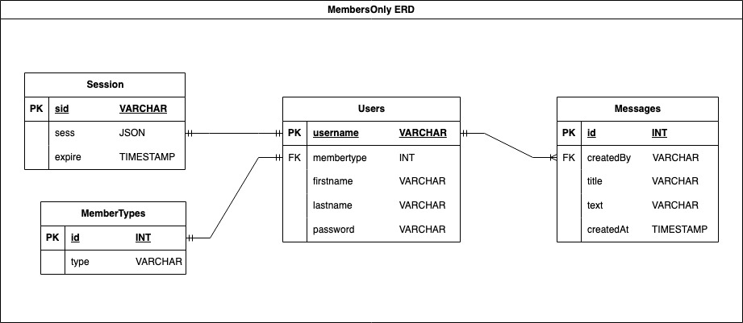
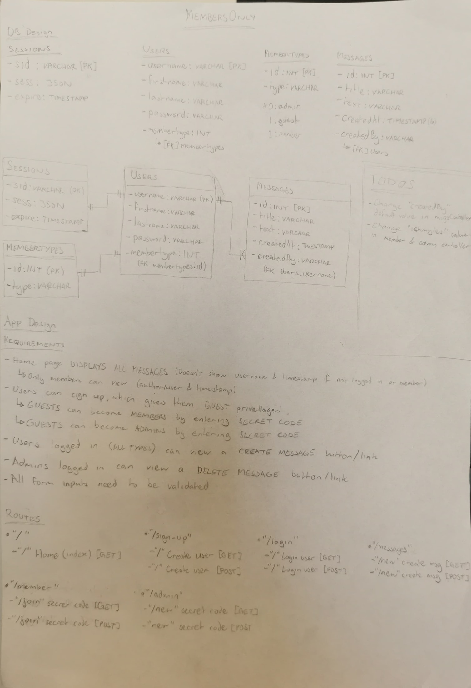

# Members Only

This repository contains a simple application that demonstrates the concepts of authentication &amp; authorisation.

- Check out the [live preview](https://members-only-production-6cc8.up.railway.app/)

## Technologies Used

- Node
- Express
- PostgreSQL
- JavaScript
- EJS

## Installation

1. **Clone the repository**:

   ```bash
   git clone https://github.com/ishmyles/members-only.git
   cd members-only
   ```

2. **Install dependencies**:

   ```bash
   npm install
   ```

3. **Set up environment variables**:

   Create a `.env` file in the root directory and add the following variables:

   ```env
    PORT=3000
    MEMBER_SECRET="<Enter a password>"
    ADMIN_SECRET="<Enter a password>"
    DB_CONN="postgres://<DB_USERNAME>:<PASSWORD>@localhost:5432/<DB_NAME>"
    COOKIE_SECRET=<Enter secret value>
    SALT_KEY="<Enter salt value>"

   ```

4. **Start the application**:

   ```bash
   node --watch --env-file .env app.js
   ```

   The app will be accessible at `http://localhost:3000`.

5. **Terminating the application**:

   Press Ctrl + C to terminate app.

## App Design

### Requirements

- Home page displays ALL MESSAGES
- AUTHORISED users can view the message author & timestamp
- NON-AUTHORISED users cannot view the message author & timestamp
- Users can sign up for GUEST privileges
- GUESTS can change their priveleges to a MEMBER privelege by entering the MEMBER code
- GUESTS & MEMBERS can change their priveleges to a ADMIN privelege by entering the ADMIN code
- AUTHENTICATED users can view a create message button/link
- AUTHENTICATED ADMINS can view a delete message button/link
- All form inputs need to be validated

### ERD



### Written Design


